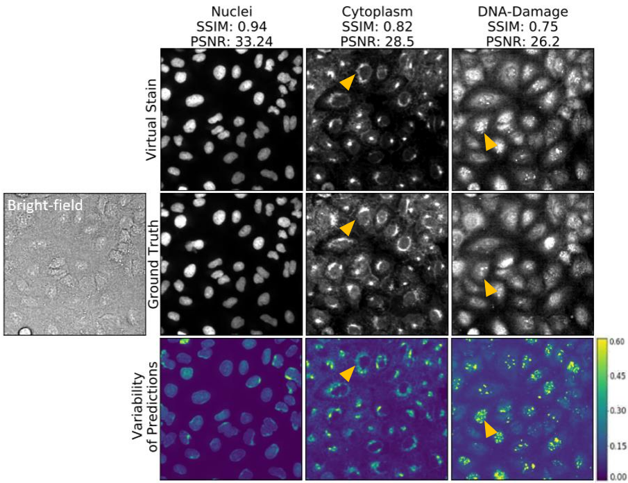

<br><br>

# Evaluation of virtual staining for high-throughput screening




### [Paper](https://ieeexplore.ieee.org/abstract/document/10230501?casa_token=NEyrUDqvFfIAAAAA:tklGisf9BEKWVjoZ6pgryKvLbF6JyurOu5Jrgoia1QQLpAMdCSlP9gMa02f3w37PvVjdiWCvFhA) <br>
Pytorch implementation of adapted pix2pixHD method for high-resolution (e.g. 1080x1080) virtual staining via image-to-image translation.
## Prerequisites
- Linux or macOS
- Python 2 or 3
- NVIDIA GPU (11G memory or larger) + CUDA cuDNN

## Getting Started
To create a conda environment from the `pix2pixHDCUDA11_environment.yml` file, follow these instructions:
1. Open a terminal or command prompt.
2. Navigate to the directory where the `pix2pixHDCUDA11_environment.yml` file is located. 
3. Run the following command to create the conda environment:
  ```bash
  conda env create -f pix2pixHDCUDA11_environment.yml
  ```
  This command will read the `pix2pixHDCUDA11_environment.yml` file and create a new conda environment with the specified dependencies.
4. Wait for the environment creation process to complete. Conda will download and install all the necessary packages.
5. Once the environment is created, activate it by running the following command:
  ```bash
  conda activate <environment_name>
  ```
  Replace `<environment_name>` with the name you want to give to the environment.
6. You can now use the conda environment with all the installed dependencies for your project.
Remember to replace `<environment_name>` with a suitable name for your environment. You can choose any name you like.
7. Install python libraries [dominate](https://github.com/Knio/dominate).
```bash
pip install dominate
```
- Clone this repo:
```bash
git clone git@github.com:Tonks684/GANs_MI2I.git
cd pix2pixHD
```

### Training
```bash
python ../pix2pixHD/train_tesaro.py --dataroot ../ --data_type 16 --batchSize 4 --checkpoints_dir ../../results/dlmbl_vscyto --label_nc 0 --name dlmbl_vscyto --no_instance  --resize_or_crop none --input_nc 1 --output_nc 1 --seed 42 --no_vgg_loss  --nThreads 1 --loadSize 256 --ndf 32 --norm instance --use_dropout  --fp16 --gpu_ids 1
```
- To view training results, please launch `tensorboard --logdir opt.checpoints_dir`

### Multi-GPU training
```bash
python ../pix2pixHD/train_tesaro.py --dataroot ../ --data_type 16 --batchSize 4 --checkpoints_dir ../../results/dlmbl_vscyto --label_nc 0 --name dlmbl_vscyto --no_instance  --resize_or_crop none --input_nc 1 --output_nc 1 --seed 42 --no_vgg_loss  --nThreads 1 --loadSize 256 --ndf 32 --norm instance --use_dropout  --fp16 --gpu_ids 1,2,3
```
### Training with Automatic Mixed Precision (AMP) for faster speed
- To train with mixed precision support, please first install apex from: https://github.com/NVIDIA/apex
- You can then train the model by adding `--fp16`. For example,
```bash
#!./scripts/train_512p_fp16.sh
python -m torch.distributed.launch train.py --name label2city_512p --fp16
```
### Training with your own dataset
- If you want to train with your own dataset, please generate label maps which are one-channel whose pixel values correspond to the object labels (i.e. 0,1,...,N-1, where N is the number of labels). This is because we need to generate one-hot vectors from the label maps. Please also specity `--label_nc N` during both training and testing.
- If your input is not a label map, please just specify `--label_nc 0` which will directly use the RGB colors as input. The folders should then be named `train_A`, `train_B` instead of `train_label`, `train_img`, where the goal is to translate images from A to B.
- If you don't have instance maps or don't want to use them, please specify `--no_instance`.
- The default setting for preprocessing is `scale_width`, which will scale the width of all training images to `opt.loadSize` (1024) while keeping the aspect ratio. If you want a different setting, please change it by using the `--resize_or_crop` option. For example, `scale_width_and_crop` first resizes the image to have width `opt.loadSize` and then does random cropping of size `(opt.fineSize, opt.fineSize)`. `crop` skips the resizing step and only performs random cropping. If you don't want any preprocessing, please specify `none`, which will do nothing other than making sure the image is divisible by 32.

### Testing
- A few example Cityscapes test images are included in the `datasets` folder.
- Please download the pre-trained Cityscapes model from [here](https://drive.google.com/file/d/1h9SykUnuZul7J3Nbms2QGH1wa85nbN2-/view?usp=sharing) (google drive link), and put it under `./checkpoints/label2city_1024p/`
- Test the model (`bash ./scripts/test_1024p.sh`):
```bash
#!./scripts/test_1024p.sh
python test.py --name label2city_1024p --netG local --ngf 32 --resize_or_crop none
```
The test results will be saved to a html file here: `./results/label2city_1024p/test_latest/index.html`.

More example scripts can be found in the `scripts` directory.


## Acknowledgments
This code borrows heavily from [pytorch-CycleGAN-and-pix2pix](https://github.com/junyanz/pytorch-CycleGAN-and-pix2pix).
